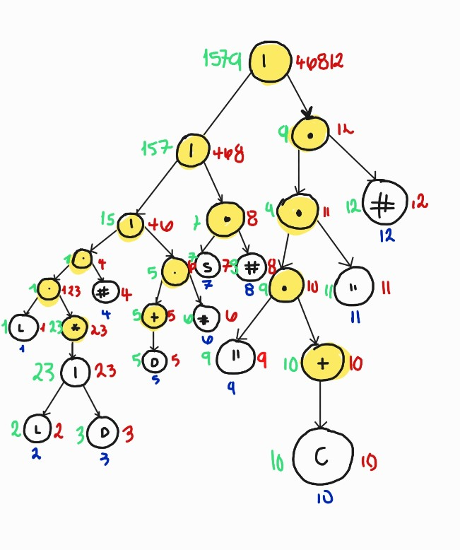
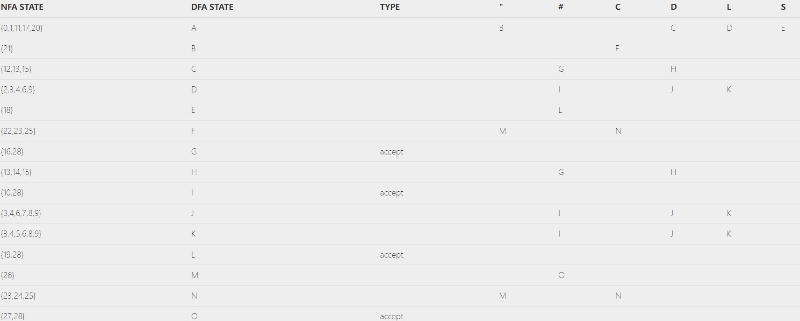
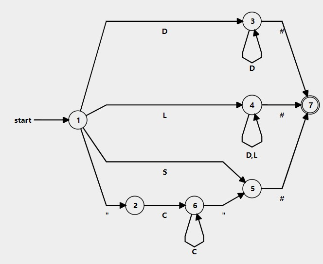

# Manual Técnico

**Descripción Breve:** El proyecto presentado tiene como objetivo desarrollar una aplicación que permita analizar y visualizar datos de localización geográfica para una empresa que desea establecer una nueva oficina en una región con menor saturación de mercado. Utiliza un archivo con formato .ORG, cuya estructura incluye información de continentes, países, población, saturación y banderas. La aplicación se construirá en Fortran para el análisis y Python con Tkinter para la interfaz gráfica.

La aplicación deberá analizar los datos léxicos del archivo de entrada, generar reportes en HTML y gráficos visuales con Graphviz, priorizando países con menor saturación.

### Autómata

Para llevar a cabo el desarrollo del proyecto, el primer paso fue aplicar el método del árbol, una técnica utilizada para representar gráficamente las posibles transiciones de un autómata finito determinista (AFD). Este método permite desglosar el problema en etapas más pequeñas y manejables, facilitando el diseño del autómata que se encargará de procesar el lenguaje definido en el archivo de entrada.

Explicación del diagrama:

Definiciones:
S -> {: ;{ }}
C -> Todos los caracteres excepto """
L -> letras minusculas
D-> [0,9]
Expresiones Regulares:

L(L|D)* #1 Acepta una letra minuscula y luego varias letras o numeros
D+ #2 Acepta digitos
S #
" C+ " #4 Cualquier Cadena

Estas expresiones regulares definen cuatro patrones diferentes:

Identificador: Comienza con una letra minúscula, seguida de cualquier número de letras o dígitos, y termina con #1.
Número: Uno o más dígitos, seguidos de #2.
Símbolo especial: Solo el carácter S, seguido de #.
Cadena: Comienza y termina con comillas dobles, contiene uno o más caracteres que no son comillas en el medio, y termina con #4.

Cada patrón termina con un símbolo # seguido de un número (excepto el patrón S).


A continuación, se implementaron cuidadosamente cada uno de los pasos del método del árbol. Esto incluyó la asignación de los conjuntos first, last, y follows para cada nodo, así como el análisis y definición de todos los elementos requeridos en cada hoja del árbol. De esta forma, se aseguró que cada nodo contara con la información necesaria para un análisis completo y coherente. Una vez completado este proceso meticuloso, el árbol resultante presentó la estructura final de la siguiente manera:



Con la información del árbol realizado, se pudo determinar la tabla del Follow y la tabla de transiciones. Ya con esta última tabla, se logró determinar de manera precisa el autómata requerido para tal proyecto. Gracias a la aplicación de este método, se obtuve el autómata con menor número de estados y transiciones disponibles.



Para que se viera un tanto más estético y entendible, se usó una página web para graficarlo, la cual es llamada "Finite State Machine Designer", del cual, se puede mencionar que su uso es bastante sencillo y funcional, por lo tanto, el autómata quedó así:



Yo con el autómata hecho, ya solo tocaba codificarlo. Por lo tanto, en el módulo lexico.f90 se hicieron estas siguientes subrutinas: 

#### Tipo Analizador
El tipo Analizador encapsula el estado y los datos necesarios para realizar el análisis léxico de una entrada de texto.

### Atributos
1. **hay_errores (logical)**: Indica si se han detectado errores durante el análisis. Inicialmente es `.false.`.
2. **estado (integer)**: Representa el estado actual del analizador. Inicialmente es `0`.
3. **tokens (type(Token))**: Arreglo que almacena los tokens identificados. Tamaño máximo definido por `MAX_TOKENS`.
4. **errores (type(Error))**: Arreglo que almacena los errores detectados. Tamaño máximo definido por `MAX_ERRORES`.
5. **linea (integer)**: Número de línea actual en la entrada. Inicialmente `1`.
6. **columna (integer)**: Número de columna actual en la línea. Inicialmente `1`.
7. **iTokens (integer)**: Índice actual para agregar tokens. Inicialmente `1`.
8. **iErrores (integer)**: Índice actual para agregar errores. Inicialmente `1`.
9. **i (integer)**: Índice para recorrer la entrada. Inicialmente `1`.
10. **buffer (character(:), allocatable)**: Buffer para almacenar caracteres temporalmente durante el análisis.


### Métodos

El tipo `Analizador` contiene los siguientes métodos para gestionar el análisis:

1. **analizar**: Inicia el proceso de análisis de la entrada.
2. **agregarToken**: Agrega un token al arreglo de tokens.
3. **agregarError**: Agrega un error al arreglo de errores.
4. **estado0**, **estado1**, **estado2**, **estado3**: Manejan los diferentes estados del analizador.
5. **generarReporteTokens**: Genera un reporte en formato HTML de los tokens identificados.
6. **generarReporteErrores**: Genera un reporte en formato HTML de los errores detectados.
7. **tieneErrores**: Verifica si se han detectado errores durante el análisis.


### Subrutinas y Funciones

#### Métodos Públicos

### analizar

**Descripción:**
Realiza el análisis léxico de una cadena de entrada, identificando tokens válidos y detectando errores.

**Parámetros:**

- **this** (class(Analizador), intent(inout)): Instancia del analizador que realizará el análisis.
- **entrada** (character(len=*), intent(in)): Cadena de texto que se va a analizar.

**Funcionamiento:**

1. Inicializa los índices y el estado del analizador.
2. Recorre cada carácter de la entrada.
3. Según el estado actual, invoca la subrutina correspondiente (`estado0`, `estado1`, `estado2`, `estado3`).
4. Incrementa el índice de recorrido.
5. Al finalizar, genera los reportes de tokens y errores en archivos HTML.

### agregarToken

**Descripción:**
Agrega un nuevo token al arreglo de tokens del analizador.

**Parámetros:**

- **this** (class(Analizador), intent(inout)): Instancia del analizador.
- **nombre** (character(len=*), intent(in)): Nombre del token.
- **lexema** (character(len=*), intent(in)): Lexema correspondiente al token.
- **linea** (integer, intent(in)): Número de línea donde se encuentra el token.
- **columna** (integer, intent(in)): Número de columna donde se encuentra el token.

**Funcionamiento:**

1. Verifica que no se exceda el número máximo de tokens.
2. Crea un nuevo token utilizando el método `crearToken` del tipo `Token`.
3. Incrementa el índice de tokens.
   
### agregarError

**Descripción:**
Agrega un nuevo error al arreglo de errores del analizador.

**Parámetros:**

- **this** (class(Analizador), intent(inout)): Instancia del analizador.
- **caracter** (character(len=*), intent(in)): Carácter que causó el error.
- **descripcion** (character(len=*), intent(in)): Descripción del error.
- **linea** (integer, intent(in)): Número de línea donde se detectó el error.
- **columna** (integer, intent(in)): Número de columna donde se detectó el error.

**Funcionamiento:**

1. Verifica que no se exceda el número máximo de errores.
2. Crea un nuevo error utilizando el método `crearError` del tipo `Error`.
3. Incrementa el índice de errores.
4. Marca que se han detectado errores (`hay_errores = .true.`).

### generarReporteTokens

**Descripción:**
Genera un reporte en formato HTML que contiene todos los tokens identificados durante el análisis.

**Parámetros:**

- **this** (class(Analizador), intent(in)): Instancia del analizador.
- **archivo** (character(len=*), intent(in)): Nombre del archivo HTML donde se generará el reporte.

**Funcionamiento:**

1. Abre el archivo especificado para escritura.
2. Escribe la estructura HTML básica y el encabezado de la tabla.
3. Itera sobre todos los tokens y los inserta en la tabla HTML.
4. Cierra las etiquetas HTML y el archivo.

### generarReporteErrores

**Descripción:**
Genera un reporte en formato HTML que contiene todos los errores detectados durante el análisis.

**Parámetros:**

- **this** (class(Analizador), intent(in)): Instancia del analizador.
- **archivo** (character(len=*), intent(in)): Nombre del archivo HTML donde se generará el reporte.

**Funcionamiento:**

1. Abre el archivo especificado para escritura.
2. Escribe la estructura HTML básica y el encabezado de la tabla.
3. Itera sobre todos los errores y los inserta en la tabla HTML.
4. Cierra las etiquetas HTML y el archivo.

### tieneErrores

**Descripción:**
Verifica si se han detectado errores durante el análisis.

**Parámetros:**

- **this** (class(Analizador), intent(in)): Instancia del analizador.

**Valor de Retorno:**

- **has_errors** (logical): `TRUE` si se han detectado errores, `FALSE` en caso contrario.

**Funcionamiento:**

1. Simplemente retorna el valor del atributo `hay_errores`.

### Procedimientos Privados

#### estado0

**Descripción:**
Maneja el estado 0 del analizador, que es el estado inicial donde se espera identificar el tipo de siguiente token.

**Parámetros:**

- **this** (class(Analizador), intent(inout)): Instancia del analizador.
- **caracter** (character(len=1), intent(in)): Carácter actual a procesar.

**Funcionamiento:**

1. Dependiendo del carácter, cambia el estado del analizador:
   - Letras (A-Z, a-z): Inicia el estado 1 para identificar palabras reservadas o identificadores.
   - Comillas ("): Inicia el estado 2 para manejar cadenas.
   - Dígitos (0-9): Inicia el estado 3 para manejar números enteros.
   - Caracteres especiales (:, {, }, %, ;): Agrega el token correspondiente.
   - Nueva línea: Incrementa el contador de líneas y reinicia la columna.
   - Espacios y tabulaciones: Ignora.
   - Otros caracteres: Agrega un error de carácter no válido.
2. Incrementa el contador de columna.

#### estado1

**Descripción:**
Maneja el estado 1, donde se están leyendo caracteres alfabéticos para formar una palabra reservada o un identificador.

**Parámetros:**

- **this** (class(Analizador), intent(inout)): Instancia del analizador.
- **caracter** (character(len=1), intent(in)): Carácter actual a procesar.

**Funcionamiento:**

1. Si el siguiente carácter es alfabético (`is_alpha`), lo añade al buffer.
2. Si no:
   - Verifica si el buffer contiene una palabra reservada (`is_reserved_word`).
   - Si es una palabra reservada, agrega el token correspondiente.
   - Si no, agrega un error indicando una palabra reservada mal escrita o un identificador no válido.
3. Reinicia el buffer y cambia el estado a 0.
4. Decrementa el índice `i` para re-evaluar el carácter actual en el estado 0.
5. Incrementa el contador de columna.

#### estado2

**Descripción:**
Maneja el estado 2, donde se están leyendo caracteres dentro de una cadena delimitada por comillas.

**Parámetros:**

- **this** (class(Analizador), intent(inout)): Instancia del analizador.
- **caracter** (character(len=1), intent(in)): Carácter actual a procesar.

**Funcionamiento:**

1. Añade el carácter al buffer.
2. Si encuentra una comilla de cierre ("):
   - Agrega el token de tipo cadena con el contenido del buffer.
   - Reinicia el buffer y cambia el estado a 0.
3. Incrementa el contador de columna.

#### estado3

**Descripción:**
Maneja el estado 3, donde se están leyendo dígitos para formar un número entero.

**Parámetros:**

- **this** (class(Analizador), intent(inout)): Instancia del analizador.
- **caracter** (character(len=1), intent(in)): Carácter actual a procesar.

**Funcionamiento:**

1. Si el siguiente carácter es un dígito (`is_digit`), lo añade al buffer.
2. Si no:
   - Agrega el token de tipo entero con el contenido del buffer.
   - Reinicia el buffer y cambia el estado a 0.
3. Decrementa el índice `i` para re-evaluar el carácter actual en el estado 0.
4. Incrementa el contador de columna.


## Funciones Auxiliares

### is_alpha

**Descripción:** Determina si un carácter es alfabético (A-Z o a-z).

**Firma:**
```fortran
function is_alpha(char) result(res)
```

**Parámetros:**
- `char` (character(len=1), intent(in)): Carácter a evaluar.

**Valor de Retorno:**
- `res` (logical): TRUE si el carácter es alfabético, FALSE en caso contrario.

**Implementación:**
```fortran
res = (char >= 'A' .and. char <= 'Z') .or. (char >= 'a' .and. char <= 'z')
```

### is_digit

**Descripción:** Determina si un carácter es un dígito (0-9).

**Firma:**
```fortran
function is_digit(char) result(res)
```

**Parámetros:**
- `char` (character(len=1), intent(in)): Carácter a evaluar.

**Valor de Retorno:**
- `res` (logical): TRUE si el carácter es un dígito, FALSE en caso contrario.

**Implementación:**
```fortran
res = char >= '0' .and. char <= '9'
```

### is_reserved_word

**Descripción:** Verifica si una palabra pertenece a la lista de palabras reservadas.

**Firma:**
```fortran
function is_reserved_word(word) result(res)
```

**Parámetros:**
- `word` (character(len=*), intent(in)): Palabra a evaluar.

**Valor de Retorno:**
- `res` (logical): TRUE si la palabra es reservada, FALSE en caso contrario.

**Implementación:**
```fortran
character(len=9), dimension(7), parameter :: reserved_words = &
    [character(len=9) :: "grafica", "nombre", "continente", "pais", "poblacion", "saturacion", "bandera"]
```
Itera sobre el arreglo `reserved_words` y compara con `word`.

### get_token_name

**Descripción:** Obtiene el nombre del token correspondiente a un carácter especial.

**Firma:**
```fortran
function get_token_name(char) result(name)
```

**Parámetros:**
- `char` (character(len=1), intent(in)): Carácter del cual obtener el nombre del token.

**Valor de Retorno:**
- `name` (character(len=15)): Nombre del token correspondiente.

**Implementación:**
Utiliza una estructura `select case` para mapear caracteres a nombres de tokens:
- `:` → `dos_puntos`
- `{` → `llave_abre`
- `}` → `llave_cierra`
- `%` → `porcentaje`
- `;` → `punto_y_coma`
- Otros → `desconocido`


