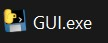
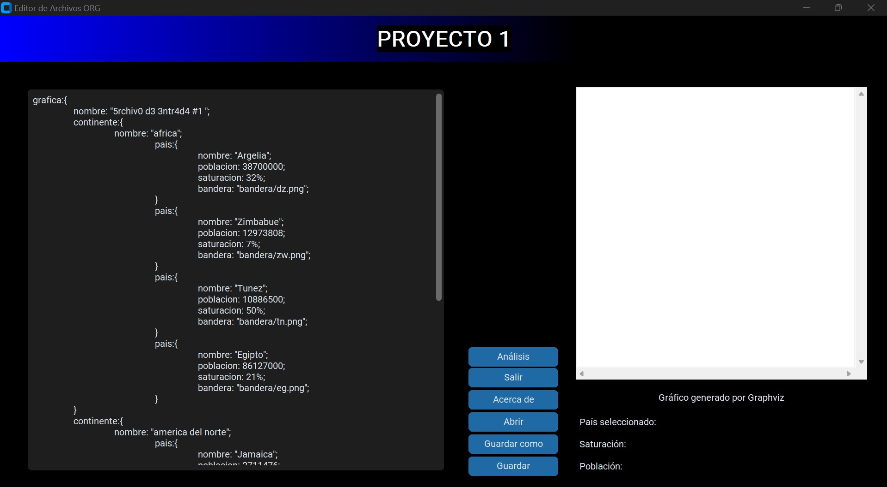
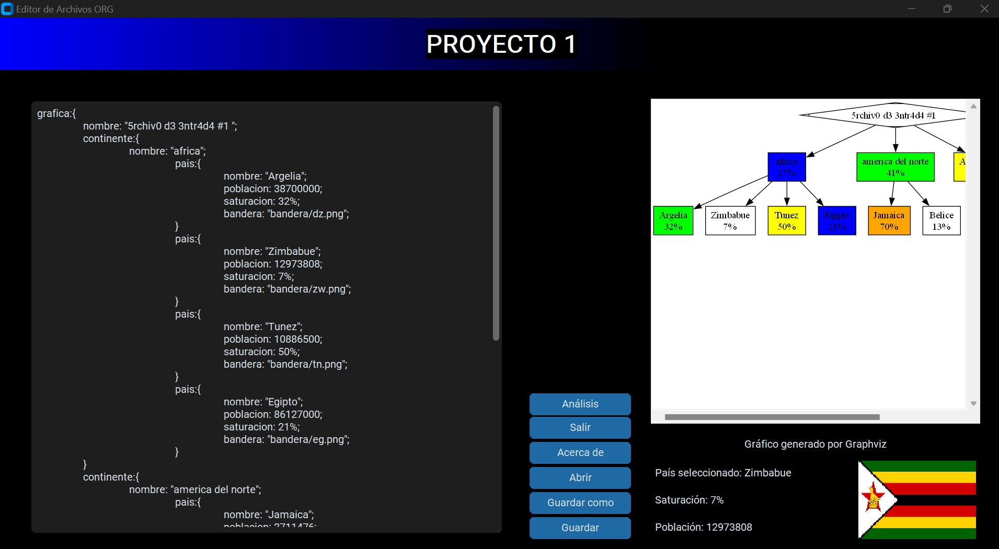
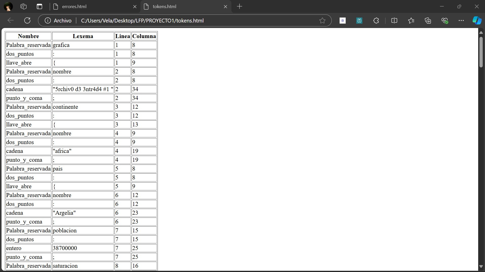
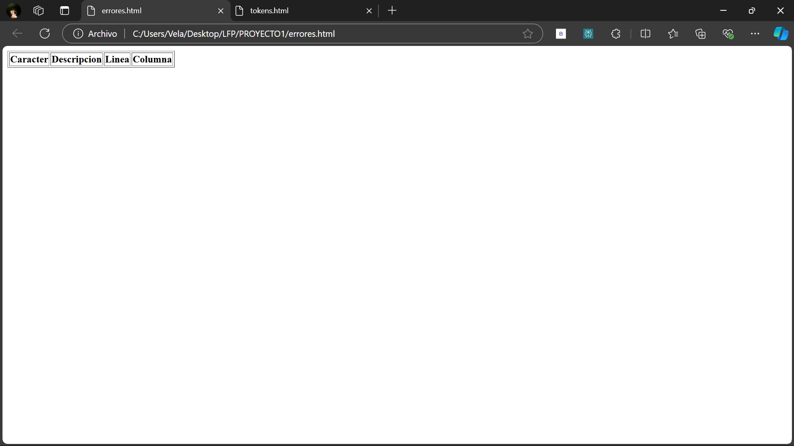

# Manual De Usuario

En este proyecto se desarrolló una aplicación con el objetivo de analizar cuál es el mejor país para establecer un comercio, basándose en la saturación de los países propuestos en un archivo .ORG que se debe cargar en el programa.

Para utilizar la aplicación, primero debe descargarse el ejecutable `GUI.exe` desde mi repositorio en GitHub. Al descargar el archivo, es necesario descomprimir el contenido si se descargó en formato .zip. Una vez hecho esto, se podrá ejecutar directamente el archivo `GUI.exe`, el cual iniciará la interfaz gráfica. A partir de ahí, podrá cargar el archivo .ORG y comenzar a utilizar las funcionalidades del programa.

Dentro de la aplicación, el usuario contará con un área para editar texto o, si lo prefiere, podrá cargar un archivo con extensión .ORG para ser analizado. En el menú, ubicado en la parte inferior del programa, se dispondrán de seis opciones principales:

1. **Abrir**: Permite cargar archivos con extensión .ORG desde su ubicación en el equipo.
2. **Guardar**: Permite guardar el texto que se encuentra en el editor. Si el archivo no ha sido guardado anteriormente, se ofrecerá la opción de ingresar un nombre y seleccionar la ubicación donde se desea guardar.
3. **Guardar como**: Permite guardar el archivo con un nombre diferente, solicitando al usuario el nuevo nombre y ubicación.
4. **Analizar**: Realiza el análisis léxico del contenido que esté en el editor y genera la salida correspondiente.
5. **Salir**: Cierra la aplicación.
6. **Acerca de**: Muestra información del estudiante.

Después de ingresar o cargar la información a ser analizada, el programa mostrará los resultados correspondientes al análisis realizado.

Una vez que haya ingresado todo lo que desea analizar, haga clic en el botón "Analizar" que se encuentra debajo del editor de texto y espere a que se generen los resultados. Cuando el análisis haya finalizado, los datos obtenidos se mostrarán en pantalla.

Si el análisis se ha completado correctamente, además de mostrar los resultados en pantalla, el programa generará dos archivos HTML. Estos archivos contendrán un desglose detallado de todos los errores y tokens identificados en el contenido que haya ingresado o cargado. El HTML se guardará automáticamente en la ubicación predeterminada o en la carpeta que elija, permitiendo una consulta más cómoda y visual de los resultados. Este archivo le permitirá revisar de manera clara y organizada los componentes léxicos del texto, lo que facilita el análisis posterior o su integración en otros procesos.

Por último, es importante destacar que al cerrar el programa, usted tendrá la opción de guardar todo el contenido que ha ingresado en el editor de texto. Sin embargo, es fundamental tener en cuenta que esta acción no incluirá el resultado del análisis realizado. Por lo tanto, si desea conservar los resultados del análisis, asegúrese de guardarlos de manera independiente, ya sea en el formato que el programa ofrezca o copiándolos manualmente. De esta manera, podrá mantener un registro completo de su trabajo y los resultados obtenidos, asegurándose de no perder información valiosa. Recuerde que la gestión adecuada de sus archivos le permitirá acceder fácilmente a ellos en futuras sesiones.