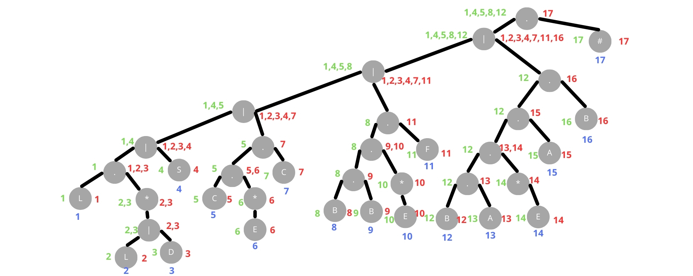
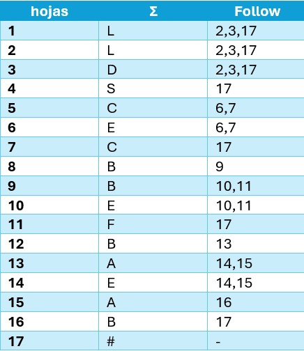
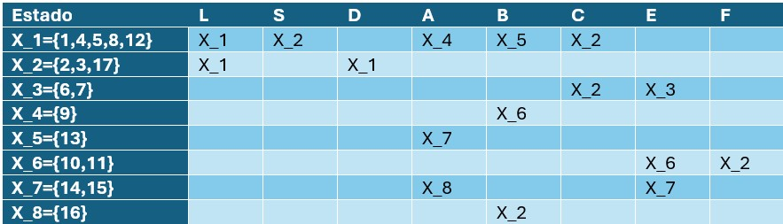
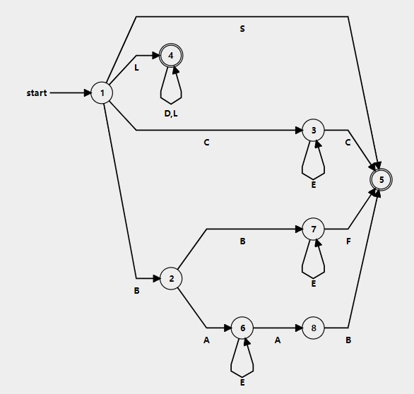
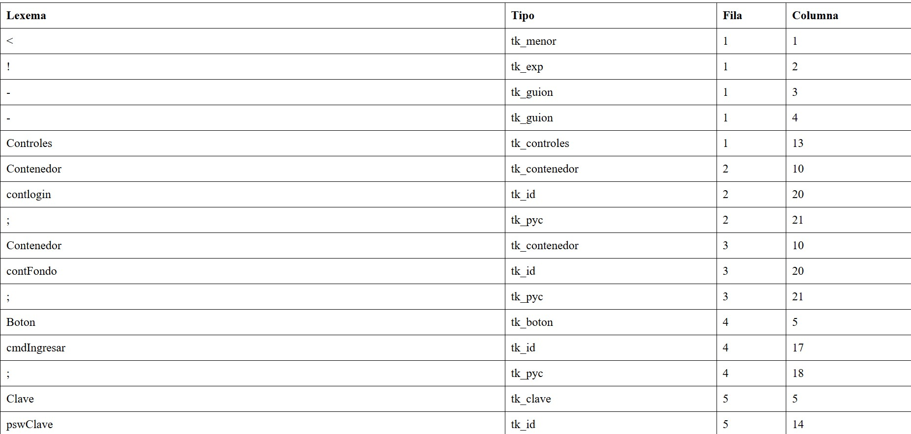
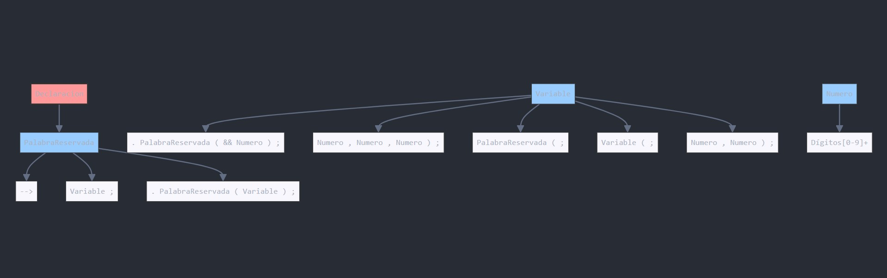

# Manual Técnico

## Descripción del Programa

Este manual técnico describe el desarrollo y funcionamiento de un programa cuyo objetivo principal es crear una página web utilizando un enfoque que combina los lenguajes de programación **Fortran** y **Python**. La aplicación en cuestión incluye un **analizador léxico** y **sintáctico** que permite procesar una entrada estructurada de forma similar a la construcción de interfaces en Java. A través de este mecanismo, los usuarios pueden definir elementos de una interfaz de usuario o estructura web utilizando una sintaxis familiar y consistente con el estilo de programación de Java, pero soportada por la robustez y capacidades de Fortran y Python.

El programa está diseñado para facilitar la generación de páginas web mediante una entrada controlada, que es procesada por el analizador para validar y estructurar los elementos definidos por el usuario. El **analizador léxico** se encarga de descomponer la entrada en tokens (o componentes básicos de código), mientras que el **analizador sintáctico** verifica que dichos tokens sigan las reglas de la gramática previamente establecida. Este proceso asegura que la entrada proporcionada sea válida antes de proceder a la creación de la página web.

El uso de **Python** en este contexto se justifica por su capacidad para manejar y procesar datos de manera eficiente, mientras que **Fortran** se utiliza en el backend para aprovechar sus capacidades numéricas y de procesamiento de alto rendimiento en tareas específicas. Ambos lenguajes se integran de manera fluida para crear un sistema que no solo es funcional, sino que también optimiza el rendimiento en escenarios donde se requiere procesamiento intensivo.

Este enfoque híbrido de lenguajes permite una mayor flexibilidad y control sobre la creación de interfaces, ofreciendo a los usuarios una experiencia de desarrollo que combina la familiaridad de Java con la potencia y eficiencia de lenguajes más especializados como Fortran y Python.

### Objetivo del Programa

El principal objetivo del programa es proporcionar una herramienta que permita a los desarrolladores generar interfaces web de manera estructurada y eficiente. Esto se logra mediante el uso de un sistema de análisis que procesa y valida la entrada del usuario, asegurando que cumpla con las reglas establecidas, y finalmente genera el código correspondiente para la página web.

Los desarrolladores que utilicen este programa podrán crear estructuras de interfaz web de manera rápida, sin necesidad de preocuparse por los detalles de sintaxis de HTML o CSS, ya que la entrada sigue una lógica y estructura que recuerda a la programación orientada a objetos y a la creación de interfaces en Java.

### Estructura General del Programa

1. **Entrada del Usuario:** El usuario proporciona una entrada que define los elementos de la interfaz web, utilizando una sintaxis que sigue las convenciones del lenguaje Java.
   
2. **Analizador Léxico:** Este módulo toma la entrada del usuario y la descompone en tokens, que son los componentes básicos de la entrada.

3. **Analizador Sintáctico:** Este módulo toma los tokens generados por el analizador léxico y verifica que sigan las reglas gramaticales del programa. Si se encuentra un error en la sintaxis, el programa notifica al usuario para que realice las correcciones necesarias.

4. **Generación de Código:** Una vez que la entrada ha sido validada, el programa procede a generar el código de la página web utilizando las especificaciones proporcionadas.

5. **Salida:** El programa produce el código HTML y CSS necesarios para generar la página web, que luego puede ser visualizada en un navegador.

### Lenguajes Utilizados

- **Fortran:** Se utiliza para el procesamiento de tareas específicas que requieren un alto rendimiento, especialmente aquellas relacionadas con cálculos numéricos o manejo de grandes volúmenes de datos.
- **Python:** Es el lenguaje principal que maneja la lógica del programa, incluyendo el análisis léxico y sintáctico, así como la generación del código HTML y CSS para la página web.

### Ventajas del Programa

- **Facilidad de Uso:** Al utilizar una sintaxis similar a la de Java, los desarrolladores familiarizados con este lenguaje encontrarán intuitivo el proceso de definición de interfaces web.
- **Validación Automática:** El sistema asegura que la entrada del usuario cumpla con las reglas establecidas, reduciendo la posibilidad de errores en la generación de la página web.
- **Optimización:** La integración de Fortran en el backend garantiza que las operaciones de alto rendimiento sean procesadas de manera eficiente.
- **Flexibilidad:** El uso de Python permite una rápida adaptación y personalización del programa para diferentes necesidades.

## Instalación y Requisitos del Sistema

### Requisitos de Hardware
- Procesador: 1.6 GHz o superior
- Memoria RAM: 4 GB mínimo (8 GB recomendado)
- Espacio en disco: 500 MB de espacio libre
- Conexión a Internet (para la instalación de componentes)

### Requisitos de Software
#### Compilador Fortran
1. **Instalación de gfortran**
   - Descargar el instalador desde: [fortran-lang.org](https://fortran-lang.org/learn/os_setup/install_gfortran/)
   - Durante la instalación, **importante**: Seleccionar la opción para agregar automáticamente al PATH
   - Verificar la instalación en terminal mediante:
     ```bash
     gfortran --version
     ```

#### Python y Dependencias
1. **Python**
   - Versión recomendada: 3.8 o superior
   - Verificar instalación:
     ```bash
     python --version
     ```

2. **Bibliotecas Requeridas**
   - Tkinter (interfaz gráfica):
     ```bash
     pip install tk
     ```
   - Otras dependencias:
     ```bash
     pip install pandas numpy matplotlib
     ```

### Requisitos del Entorno de Desarrollo (IDE)

#### Características Necesarias
1. **Compatibilidad con Fortran**
   - Soporte para compilación de código Fortran
   - Depurador integrado para Fortran
   - Terminal integrada con acceso a comandos gfortran

2. **Herramientas Python**
   - Soporte para pip y gestión de paquetes
   - Integración con entornos virtuales
   - Depurador Python

3. **Características del Editor**
   - Resaltado de sintaxis para Fortran y Python
   - Autocompletado de código
   - Navegación inteligente en el código
   - Sistema de control de versiones integrado
   - Soporte para múltiples archivos y proyectos

#### IDE Recomendado: Visual Studio Code
1. **Extensiones Recomendadas**
   - Modern Fortran (soporte para Fortran)
   - Python (soporte oficial de Microsoft)
   - IntelliSense (autocompletado)
   - Git Integration (control de versiones)

## Notas Adicionales
- Se recomienda mantener actualizados todos los componentes del sistema
- Para usuarios de Windows, asegurarse de tener los permisos de administrador necesarios
- Crear copias de seguridad antes de realizar actualizaciones importantes
- Documentar cualquier modificación realizada al código fuente

## Solución de Problemas Comunes
1. **Error de PATH en Fortran**
   - Verificar la variable de entorno PATH
   - Reinstalar gfortran seleccionando la opción de PATH automático

2. **Problemas con Tkinter**
   - En Linux: `sudo apt-get install python3-tk`
   - En Windows: Reinstalar Python seleccionando la opción de tcl/tk

3. **Errores de Compilación**
   - Verificar la sintaxis del código fuente
   - Comprobar que todas las dependencias estén instaladas
   - Revisar los logs de error en la terminal

## Analizador Léxico
### Implementación del Autómata Finito Determinista (AFD)

El analizador léxico implementa un Autómata Finito Determinista (AFD) construido mediante el método del árbol, garantizando un reconocimiento preciso del lenguaje especificado.

#### 1. Expresión Regular Base
La construcción comenzó definiendo la expresión regular que representa el lenguaje:

```L(L|D)*|S|D+|CEC|BBE*F|BAE*AB```
*Figura 1: Expresión regular base del lenguaje*

#### 2. Construcción del Árbol
Se aplicó el método del árbol siguiendo estos pasos:
- Enumeración de hojas
- Determinación de nodos anulables
- Cálculo de First y Last
- Trazado de follows


*Figura 2: Método del árbol aplicado*

#### 3. Tablas de Construcción
##### Tabla de Follow

*Figura 3: Tabla de Follow resultante*

##### Tabla de Transiciones

*Figura 4: Tabla de transiciones del autómata*

#### 4. Autómata Resultante
El autómata final que reconoce el lenguaje del proyecto:


*Figura 5: Autómata Finito Determinista resultante*

# Patrones y Tokens Reconocidos

Este documento describe los patrones léxicos y tokens asociados en nuestro lenguaje de programación.

## Tabla de Patrones y Tokens

*Figura 6: Tabla de tokens*
## Leyenda de Patrones

- `L`: Representa una letra (mayúscula o minúscula)
- `D`: Representa un dígito (0-9)
- `S`: Representa un símbolo especial (por ejemplo: +, -, *, /, etc.)
- `C`: Representa una comilla doble (")
- `E`: Representa cualquier carácter excepto comilla doble
- `B`: Representa una barra diagonal (/)
- `A`: Representa un asterisco (*)
- `|`: Indica alternativa (o)
- `*`: Indica cero o más repeticiones
- `+`: Indica una o más repeticiones

## Descripción Detallada

1. **Palabras Clave e Identificadores**: 
   - Patrón: `L(L|D)*`
   - Comienzan con una letra, seguida de cualquier número de letras o dígitos.
   - Ejemplos: `if`, `while`, `contador1`

2. **Símbolos Especiales**:
   - Patrón: `S`
   - Caracteres únicos con significado especial en el lenguaje.
   - Ejemplos: `>`, `<`, `!`, `+`, `-`

3. **Valores Numéricos**:
   - Patrón: `D+`
   - Secuencia de uno o más dígitos.
   - Ejemplos: `42`, `100`, `0`

4. **Cadenas de Texto**:
   - Patrón: `CEC`
   - Texto encerrado entre comillas dobles.
   - Ejemplo: `"Hola, mundo!"`

5. **Comentarios de Una Línea**:
   - Patrón: `BBE*F`
   - Comienzan con `//` y continúan hasta el final de la línea.
   - Ejemplo: `// Este es un comentario de una línea`

6. **Comentarios Multilinea**:
   - Patrón: `BAE*AB`
   - Comienzan con `/*` y terminan con `*/`, pueden abarcar múltiples líneas.
   - Ejemplo:
     ```
     /* Este es un comentario
        de varias líneas */
     ```

## Notas Adicionales

- Los patrones están expresados en la forma especificada por la expresión regular base.
- La implementación exacta puede variar dependiendo del analizador léxico utilizado.
- Se recomienda probar estos patrones con un conjunto diverso de entradas para asegurar su correcta funcionalidad.

## Analizador Sintáctico
# Gramática Libre de Contexto

## Notación Utilizada
- Los símbolos no terminales se escriben entre `< >`
- Los símbolos terminales se escriben en `cursiva`
- El símbolo `::=` denota una producción
- El símbolo `|` denota una alternativa
- Los símbolos terminales especiales se escriben entre comillas simples

## Producciones

### Producción Inicial
```
<Declaracion> ::= <PalabraReservada>
```

### Palabras Reservadas
```
<PalabraReservada> ::= 
    | '-->' 
    | <Variable> ';'
    | '.' <PalabraReservada> '(' <Variable> ')' ';'
```

### Variables
```
<Variable> ::=
    | '.' <PalabraReservada> '(' '&&' <Numero> ')' ';'
    | <Numero> ',' <Numero> ',' <Numero> ')' ';'
    | <PalabraReservada> '(' ';'
    | '"' <Variable> '"' ';'
    | '"' '"' '(' ';'
    | <Variable> '(' ';'
    | <Numero> ',' <Numero> ')' ';'
```

### Números
```
<Numero> ::= [0-9]+
```

## Componentes Léxicos

### Símbolos Especiales
- `;` : Punto y coma
- `.` : Punto
- `(` : Paréntesis izquierdo
- `)` : Paréntesis derecho
- `,` : Coma
- `&&` : Operador AND
- `-->`  : Flecha
- `"` : Comillas

## Ejemplos de Derivaciones

### Ejemplo 1: Declaración Simple
```
<Declaracion>
=> <PalabraReservada>
=> <Variable> ';'
=> <Numero> ',' <Numero> ')' ';'
=> '5' ',' '10' ')' ';'
```

### Ejemplo 2: Declaración con Punto
```
<Declaracion>
=> <PalabraReservada>
=> '.' <PalabraReservada> '(' <Variable> ')' ';'
=> '.' 'setAncho' '(' '100' ')' ';'
```

## Reglas Adicionales

1. **Precedencia**
   - Las producciones se evalúan de izquierda a derecha
   - Los paréntesis tienen la mayor precedencia
   - Los operadores tienen precedencia sobre las variables

2. **Restricciones**
   - Los números deben ser enteros positivos
   - Las cadenas deben estar entre comillas dobles
   - Cada instrucción debe terminar con punto y coma

3. **Consideraciones Especiales**
   - Se permiten espacios en blanco entre tokens
   - Las palabras reservadas son case-sensitive
   - Los comentarios no afectan la sintaxis

## Diagrama Sintáctico

*Figura 7: Diagrama de gramatica libre de contexto*

## Notas de Implementación

1. **Manejo de Errores**
   - Falta de punto y coma al final
   - Paréntesis no balanceados
   - Números negativos o no válidos
   - Comillas no cerradas

2. **Optimizaciones**
   - Eliminación de recursividad por izquierda
   - Factorización de producciones comunes
   - Manejo eficiente de espacios en blanco


# Funciones Principales del Módulo tokenSintactico

## 1. Gestión de Elementos Léxicos

### `inicializar()`
- Inicializa la colección de elementos léxicos
- Libera la memoria si ya existe una colección previa
- Prepara el sistema para un nuevo análisis

### `agregar(valor, categoria, linea, posicion)`
- **Parámetros**:
  - valor: Contenido del elemento léxico
  - categoria: Tipo o clasificación del elemento
  - linea: Número de línea en el código fuente
  - posicion: Posición en la línea
- **Función**: Añade nuevos elementos léxicos a la colección

### `mostrar_errores()`
- Muestra todos los errores léxicos encontrados
- Formato de salida: `ERROR|Léxico|línea|posición|valor|descripción`
- Incluye contador total de errores

### `mostrar_lexemas()`
- Muestra todos los lexemas procesados
- Formato de salida: `LEXEMA|valor|categoría|línea|posición`
- Incluye contador total de lexemas

## 2. Análisis Sintáctico

### `analizar_tokens(lista_tokens)`
- **Funcionalidad principal**:
  - Analiza la estructura sintáctica del código
  - Verifica la correcta ubicación de elementos en bloques
  - Valida la sintaxis de operaciones y métodos

- **Validaciones clave**:
  - Bloques de control requeridos
  - Sintaxis de etiquetas
  - Procesamiento de textos y claves
  - Manejo de botones
  - Operaciones con identificadores

- **Verificaciones de contexto**:
  - Elementos dentro del bloque correcto
  - Existencia de bloques requeridos
  - Validación de secuencias de tokens

## 3. Procesamiento de Red

### `process_network_metrics()`
- Procesa métricas de red
- Valida conexiones de nodos
- Maneja diferentes estados de conexión

### `generate_network_report()`
- Genera reportes del estado de la red
- Documenta el estado de los nodos
- Registra detalles de conexión

### `validate_node_connection(node_id)`
- Valida la conexión de nodos específicos
- Verifica umbrales de tiempo de actividad
- Confirma protocolos de seguridad


## 1. Módulo tokenSintactico

### 1.1 Gestión de Elementos Léxicos

#### `inicializar()`
Inicializa la colección de elementos léxicos y prepara el sistema para un nuevo análisis.
- Libera memoria previa si existe
- Establece nueva colección vacía

#### `agregar(valor, categoria, linea, posicion)`
Añade nuevos elementos léxicos a la colección.
- **Parámetros:**
  - `valor`: Contenido del elemento léxico
  - `categoria`: Clasificación del elemento
  - `linea`: Número de línea en código fuente
  - `posicion`: Posición en la línea

#### `mostrar_errores()`
Visualiza todos los errores léxicos encontrados.
- Formato: `ERROR|Léxico|línea|posición|valor|descripción`
- Incluye contador total de errores
- Salida por unidad estándar

#### `mostrar_lexemas()`
Muestra todos los lexemas procesados.
- Formato: `LEXEMA|valor|categoría|línea|posición`
- Incluye contador total de lexemas

### 1.2 Análisis Sintáctico

#### `analizar_tokens(lista_tokens)`
Analiza estructura sintáctica completa del código.
- **Validaciones:**
  - Bloques de control requeridos
  - Sintaxis de etiquetas
  - Procesamiento de textos y claves
  - Manejo de botones
  - Operaciones con identificadores

#### `process_network_metrics()`
Gestiona y procesa métricas de red.
- Validación de conexiones
- Manejo de estados
- Procesamiento de estadísticas

## 2. Módulo Identificador

### 2.1 Estructura Principal

#### Tipo de Datos: `Etiqueta`
```fortran
TYPE :: Etiqueta
    CHARACTER(100) :: id        ! Identificador único
    REAL :: x, y               ! Posición
    INTEGER :: width, height    ! Dimensiones
    CHARACTER(200) :: content   ! Contenido
    INTEGER :: r, g, b         ! Colores RGB
END TYPE
```

### 2.2 Funciones de Gestión

#### `inicializar(capacidad)`
- **Propósito**: Inicializa array de etiquetas
- **Parámetro**: `capacidad` (INTEGER) - Tamaño inicial
- **Comportamiento**: Gestión de memoria dinámica

#### `agregarEtiqueta(etiqueta)`
- **Propósito**: Añade nueva etiqueta
- **Parámetro**: `etiqueta` (TYPE(Etiqueta))
- **Comportamiento**: Redimensionamiento dinámico

### 2.3 Manipulación de Etiquetas

#### `moverEtiqueta(id, x, y)`
- **Propósito**: Actualiza posición
- **Parámetros**: 
  - `id`: Identificador
  - `x, y`: Nuevas coordenadas

#### `redimensionar(id, width, height)`
- **Propósito**: Modifica dimensiones
- **Parámetros**:
  - `id`: Identificador
  - `width, height`: Nuevas dimensiones

#### `cambiarTexto(id, content)`
- **Propósito**: Actualiza contenido
- **Parámetros**:
  - `id`: Identificador
  - `content`: Nuevo contenido

#### `cambiarColor(id, r, g, b)`
- **Propósito**: Modifica color RGB
- **Parámetros**:
  - `id`: Identificador
  - `r, g, b`: Valores RGB

### 2.4 Utilidades

#### `mostrarInfo(id)`
Muestra información completa:
- ID
- Posición (x, y)
- Dimensiones
- Contenido
- Color RGB

#### `eliminarEtiqueta(id)`
- **Propósito**: Elimina etiqueta específica
- **Parámetro**: `id` - Identificador
- **Comportamiento**: Reajuste automático del array

#### `contarEtiquetas()`
- **Propósito**: Cuenta total de etiquetas
- **Retorno**: Número de etiquetas activas

### 2.5 Características Principales

1. **Gestión de Memoria**
   - Allocatable arrays
   - Redimensionamiento dinámico
   - Liberación automática

2. **Seguridad**
   - Encapsulación PRIVATE/PUBLIC
   - Validaciones de existencia
   - Manejo de errores

3. **Funcionalidad**
   - Operaciones CRUD completas
   - Manipulación precisa de atributos
   - Sistema de identificación único

# Manual Técnico - Analizador Léxico (lexer_core)

## 1. Descripción General
El programa `lexer_core` implementa un analizador léxico que procesa texto de entrada y genera tokens según las reglas definidas. Utiliza una máquina de estados para identificar y clasificar diferentes elementos del lenguaje.

## 2. Dependencias
```fortran
USE token_handler
USE error_processor
USE output_generator
USE syntax_checker
```

## 3. Variables Principales
- `input_size`: Tamaño total del texto de entrada
- `line_count`: Contador de líneas procesadas
- `char_pos`: Posición actual del carácter
- `machine_state`: Estado actual de la máquina
- `cursor`: Posición actual en el texto
- `raw_text`: Buffer del texto completo
- `token_buffer`: Buffer temporal para construcción de tokens

## 4. Estados de la Máquina (machine_state)

### Estado 0 (Inicial)
- Detecta y clasifica el primer carácter
- Determina el siguiente estado según el tipo de carácter:
  - Caracteres especiales -> Estado 1
  - Alfabéticos -> Estado 2
  - Dígitos -> Estado 3
  - Comillas -> Estado 4
  - Barra (/) -> Estado 7

### Estado 1 (Caracteres Especiales)
- Procesa caracteres especiales individuales
- Registra el token correspondiente
- Retorna al estado inicial

### Estado 2 (Identificadores)
- Procesa caracteres alfanuméricos
- Construye identificadores
- Finaliza al encontrar un carácter no alfanumérico

### Estado 3 (Números)
- Procesa secuencias de dígitos
- Construye tokens numéricos
- Finaliza al encontrar un carácter no numérico

### Estado 4 (Inicio de String)
- Inicia el procesamiento de cadenas
- Verifica el primer carácter después de comilla
- Transición a estados 5 o 6

### Estado 5 (Fin de String)
- Finaliza el procesamiento de cadenas
- Registra el token de tipo string_literal
- Retorna al estado inicial

### Estado 6 (Contenido de String)
- Procesa el contenido de la cadena
- Verifica caracteres imprimibles
- Maneja cierre de cadena

### Estados 7-8 (Comentarios)
- Estado 7: Detecta inicio de comentarios
- Estado 8: Procesa comentarios de línea
- Maneja diferentes tipos de comentarios

## 5. Funciones Principales

### Procesamiento de Entrada
```fortran
DO
  READ(*, '(A)', IOSTAT=io_result) line_buffer
  IF (io_result < 0) EXIT
  raw_text = TRIM(raw_text) // TRIM(line_buffer) // NEW_LINE('a')
END DO
```

### Procesamiento de Tokens
```fortran
CALL register_token(token_buffer, 'category', line_count, char_pos)
CALL process_identifier(token_buffer, line_count, char_pos)
```

### Generación de Reportes
```fortran
CALL parse_syntax()
CALL display_errors()
CALL generate_token_report()
CALL generate_error_report()
```

## 6. Salidas del Sistema
- Reportes de tokens
- Reportes de errores
- Información de etiquetas
- Información de contenedores
- Información de botones
- Información de claves y textos
- Archivos de salida HTML/CSS
- Tokens Python
- Errores Python

## 7. Manejo de Errores
- Caracteres inválidos
- Cadenas sin cerrar
- Caracteres no imprimibles
- Errores de sintaxis
- Registro y reporte de errores

## 8. Notas de Implementación
1. Utiliza un enfoque de máquina de estados finitos
2. Procesamiento carácter por carácter
3. Manejo robusto de errores
4. Generación de múltiples reportes
5. Soporte para diferentes tipos de tokens

## 9. Limitaciones
- Tamaño máximo de buffer: 200,000 caracteres
- Tamaño máximo de token: 200 caracteres
- Nombres de archivo fijos para salida