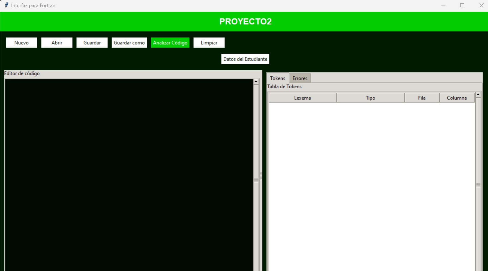
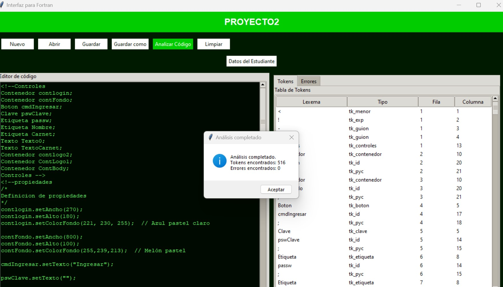
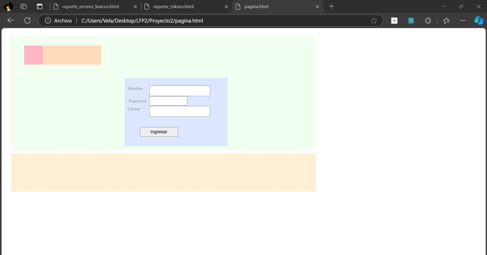
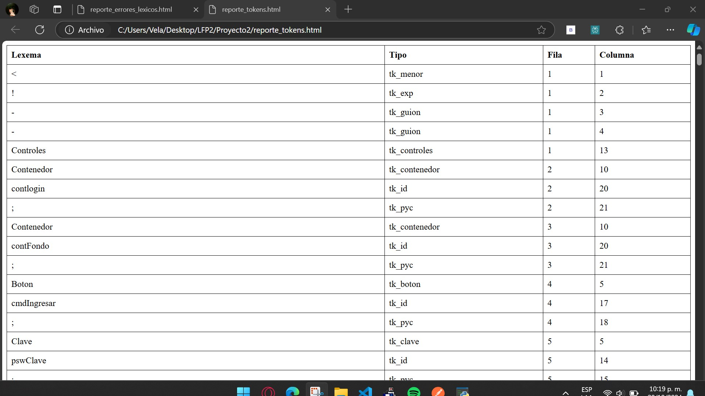
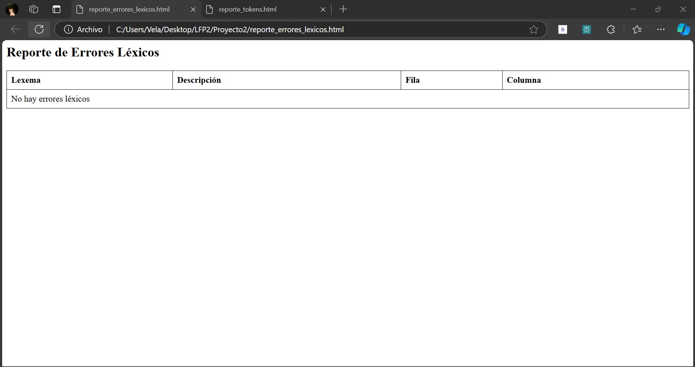
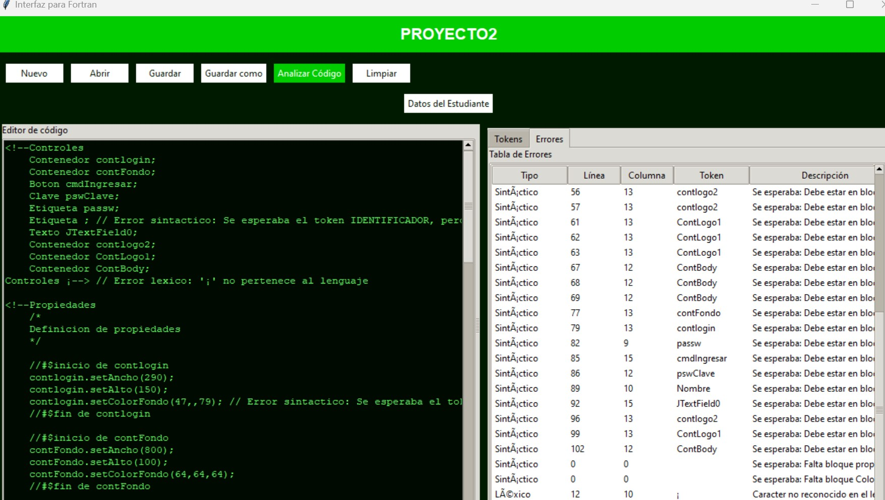

# Manual de Usuario 

## Introducción

Bienvenido al manual de usuario del Analizador de Texto y Generador HTML/CSS. Esta herramienta ha sido diseñada para proporcionar una interfaz amigable y potente que permite a los usuarios analizar archivos de texto, generar páginas HTML con sus correspondientes estilos CSS, y obtener un análisis detallado de tokens y errores.

Nuestro programa es ideal para:
- Desarrolladores web que buscan automatizar la creación de páginas HTML y CSS.
- Estudiantes de programación que desean analizar y entender la estructura de archivos de texto.
- Profesionales que necesitan una herramienta rápida para la conversión de texto a formato web.

Con una interfaz intuitiva y funciones avanzadas, nuestro software simplifica el proceso de análisis y generación de código, ahorrando tiempo y reduciendo errores.

## Instalación

Siga estos pasos para instalar el programa en su sistema:

1. **Descarga del Repositorio**
   - Visite la página oficial del proyecto en [URL del repositorio].
   - Clone el repositorio usando Git:
     ```
     git clone [URL del repositorio]
     ```
   - Alternativamente, descargue el archivo ZIP y extraiga su contenido.

2. **Verificación de Requisitos**
   - Asegúrese de tener Python 3.x instalado en su sistema.
   - Verifique la instalación de Python ejecutando en la terminal:
     ```
     python --version
     ```

3. **Instalación de Dependencias**
   - Navegue hasta el directorio del proyecto.
   - Instale las dependencias necesarias con el siguiente comando:
     ```
     pip install -r requirements.txt
     ```

4. **Ejecución del Programa**
   - Una vez instaladas las dependencias, ejecute el archivo principal:
     ```
     python main.py
     ```

## Requisitos del Sistema

Para garantizar un funcionamiento óptimo, su sistema debe cumplir con los siguientes requisitos:

### Compilador de Fortran
1. Visite [https://fortran-lang.org/learn/os_setup/install_gfortran/](https://fortran-lang.org/learn/os_setup/install_gfortran/)
2. Descargue el instalador apropiado para su sistema operativo.
3. Durante la instalación, asegúrese de seleccionar la opción para añadirlo automáticamente al Path del sistema.
4. Verifique la instalación abriendo una terminal y ejecutando:
   ```
   gfortran --version
   ```
   Si muestra una versión instalada, la instalación fue exitosa.

### Python y Librerías
1. Python 3.x (3.7 o superior recomendado)
2. Tkinter (generalmente incluido con Python)
3. Otras dependencias especificadas en el archivo `requirements.txt`

Para instalar Tkinter en caso de que no esté incluido:
- En sistemas basados en Debian/Ubuntu:
  ```
  sudo apt-get install python3-tk
  ```
- En sistemas basados en Red Hat/Fedora:
  ```
  sudo dnf install python3-tkinter
  ```
- En macOS (usando Homebrew):
  ```
  brew install python-tk
  ```

### Editor de Texto Recomendado
Para una mejor experiencia de desarrollo y edición de archivos, recomendamos usar uno de los siguientes editores:
- Visual Studio Code
- PyCharm
- Sublime Text

Estos editores ofrecen resaltado de sintaxis y otras características útiles para trabajar con archivos Python y de texto.

## Interfaz de Usuario

La interfaz principal del programa está diseñada para ser intuitiva y fácil de usar. A continuación, se describen los componentes principales:


*Figura 1: Interfaz principal del programa*

1. **Barra de Menú**
   - Archivo: Opciones para crear, abrir, guardar y cerrar archivos.
   - Editar: Funciones de edición básicas.
   - Analizar: Inicia el proceso de análisis del texto.
   - Ayuda: Acceso a la documentación y sobre el programa.

2. **Área de Edición de Texto**
   - Espacio principal donde se puede escribir o pegar el texto a analizar.
   - Admite edición directa y carga de archivos.

3. **Panel de Resultados**
   - Muestra las tablas de tokens y errores tras el análisis.
   - Se actualiza dinámicamente con cada análisis.

4. **Barra de Estado**
   - Indica el estado actual del programa y mensajes importantes.

5. **Botones de Acción Rápida**
   - Nuevo: Crea un nuevo documento en blanco.
   - Abrir: Permite cargar un archivo existente.
   - Guardar: Guarda el documento actual.
   - Analizar: Inicia el proceso de análisis.
   - Limpiar: Borra el contenido del área de edición.

## Funcionalidades Principales

### 1. Gestión de Archivos
- **Nuevo Documento**: Crea un nuevo archivo en blanco en el editor.
- **Abrir Archivo**: Permite cargar un archivo .LFP existente en el editor.
- **Guardar**: Guarda los cambios en el archivo actual.
- **Guardar Como**: Guarda el archivo actual con un nuevo nombre o ubicación.
- **Salir**: Cierra el programa, solicitando guardar cambios si es necesario.

### 2. Edición de Texto
- Funciones estándar de edición como copiar, cortar, pegar.
- Deshacer y rehacer cambios.
- Búsqueda y reemplazo de texto.

### 3. Análisis de Texto
- **Análisis Completo**: Procesa todo el contenido del editor.
- **Análisis de Selección**: Analiza solo el texto seleccionado (si está disponible).
- **Generación de Reportes**: Crea informes detallados de tokens y errores.

### 4. Visualización de Resultados
- Tablas interactivas para mostrar tokens identificados.
- Lista detallada de errores encontrados durante el análisis.

### 5. Generación de HTML/CSS
- Conversión automática del texto analizado a formato HTML.
- Generación de estilos CSS correspondientes.

### 6. Utilidades Adicionales
- **Limpieza de Área de Texto**: Borra todo el contenido del editor.
- **Información del Desarrollador**: Muestra detalles sobre el creador del programa.

## Proceso de Análisis

El proceso de análisis es el núcleo de nuestra aplicación. Siga estos pasos para realizar un análisis efectivo:

1. **Preparación del Texto**
   - Escriba o pegue el texto a analizar en el área de edición.
   - Alternativamente, cargue un archivo .LFP usando la opción "Abrir".

2. **Inicio del Análisis**
   - Haga clic en el botón "Analizar" en la barra de herramientas.
   - O seleccione "Analizar > Iniciar Análisis" desde el menú.

3. **Procesamiento**
   - El programa escaneará el texto en busca de tokens y posibles errores.
   - Una barra de progreso indicará el avance del análisis.

4. **Resultados**
   - Tras completar el análisis, se mostrarán los resultados en el panel correspondiente.
   - Si no se encuentran errores, aparecerá un mensaje de éxito.


*Figura 2: Resultado de un análisis exitoso*

5. **Revisión de Resultados**
   - Examine las tablas de tokens y errores generadas.
   - Utilice las opciones de filtrado y ordenación para una mejor visualización.

6. **Acciones Post-Análisis**
   - Genere archivos HTML/CSS basados en el análisis.
   - Guarde los reportes de tokens y errores para referencia futura.

## Visualización de Resultados

Tras completar el análisis, los resultados se presentan en dos formatos principales:

### Pagina



### Reporte de Tokens


*Figura 3: Tabla de reporte de tokens*

- Muestra todos los tokens identificados en el texto.
- Incluye información como tipo de token, valor, línea y columna.
- Permite ordenar y filtrar para facilitar el análisis.

### Reporte de Errores


*Figura 4: Tabla de reporte de errores*

- Lista todos los errores encontrados durante el análisis.
- Proporciona detalles como tipo de error, descripción, línea y columna.
- Facilita la identificación y corrección de problemas en el texto.

### Interpretación de Resultados
- **Tokens**: Representan elementos válidos reconocidos en el texto.
- **Errores**: Indican problemas sintácticos o léxicos que requieren atención.

Utilice estos reportes para refinar su texto y asegurar que cumple con la sintaxis esperada.

## Generación de HTML y CSS

Una vez completado el análisis sin errores, el programa puede generar automáticamente archivos HTML y CSS basados en el texto analizado.

### Proceso de Generación
1. Tras un análisis exitoso, seleccione "Generar HTML/CSS" desde el menú.
2. Elija una ubicación para guardar los archivos generados.
3. El programa creará:
   - Un archivo `.html` con la estructura del documento.
   - Un archivo `.css` con los estilos correspondientes.

### Personalización
- Puede modificar las plantillas de generación en la sección de configuración.
- Ajuste los estilos CSS generados según sus preferencias.

### Visualización
- Use la opción "Vista Previa" para ver el resultado en su navegador predeterminado.
- Realice ajustes adicionales en los archivos generados según sea necesario.

## Manejo de Errores

El programa está diseñado para manejar diversos tipos de errores y proporcionar feedback útil para su corrección.

### Tipos de Errores Comunes
1. **Errores Léxicos**: Caracteres o secuencias no reconocidos.
2. **Errores Sintácticos**: Estructura incorrecta en el texto.
3. **Errores Semánticos**: Uso incorrecto de elementos reconocidos.

### Cómo Interpretar los Errores
- Cada error se presenta con:
  - Tipo de error
  - Descripción detallada
  - Ubicación (línea y columna) en el texto


*Figura 5: Ejemplo de mensaje de error*

### Estrategias de Corrección
1. Identifique la ubicación exacta del error en el texto.
2. Lea cuidadosamente la descripción del error.
3. Consulte la documentación o ejemplos para entender la sintaxis correcta.
4. Realice las correcciones necesarias y vuelva a analizar.

### Prevención de Errores
- Utilice la función de autocompletado (si está disponible).
- Revise la sintaxis regularmente durante la escritura.
- Familiarícese con los patrones comunes y mejores prácticas.

## Consejos y Mejores Prácticas

Para obtener el máximo provecho de nuestro Analizador de Texto y Generador HTML/CSS, considere las siguientes recomendaciones:

1. **Organización del Código**
   - Mantenga una estructura clara y consistente en sus documentos.
   - Use indentación adecuada para mejorar la legibilidad.

2. **Uso Regular del Analizador**
   - Analice su texto frecuentemente mientras trabaja para detectar errores temprano.

3. **Aprovechamiento de Plantillas**
   - Utilice y personalice las plantillas proporcionadas para ahorrar tiempo.

4. **Backup y Versionado**
   - Guarde versiones de su trabajo regularmente.
   - Considere usar un sistema de control de versiones como Git.

5. **Optimización de Rendimiento**
   - Para archivos grandes, considere dividirlos en secciones más pequeñas.
   - Cierre otras aplicaciones pesadas al realizar análisis complejos.

6. **Actualización Regular**
   - Mantenga el software y sus dependencias actualizados para acceder a las últimas funciones y correcciones.

7. **Exploración de Funcionalidades Avanzadas**
   - Familiarícese con las opciones avanzadas de análisis y generación.
   - Experimente con diferentes configuraciones para personalizar la salida.

## Solución de Problemas Comunes

A continuación, se presentan algunos problemas frecuentes y sus posibles soluciones:

1. **El programa no inicia**
   - Verifique que Python esté correctamente instalado.
   - Asegúrese de que todas las dependencias estén instaladas.
   - Compruebe los permisos de ejecución del archivo.

2. **Errores al cargar archivos**
   - Confirme que el archivo tiene la extensión correcta (.LFP).
   - Verifique los permisos de lectura del archivo.
   - Intente abrir el archivo en un editor de texto para asegurar que no esté corrupto.

3. **El análisis no se completa**
   - Para archivos grandes, aumente el tiempo de espera en la configuración.
   - Verifique que no haya bucles infinitos en su código.
   - Intente analizar secciones más pequeñas del texto.

4. **Generación de HTML/CSS falla**
   - Asegúrese de que el análisis se completó sin errores.
   - Verifique que tiene permisos de escritura en el directorio de salida.
   - Revise la configuración de las plantillas de generación.

5. **Rendimiento lento**
   - Cierre aplicaciones innecesarias para liberar recursos.
   - Para archivos muy grandes, considere dividirlos en partes más pequeñas.
   - Verifique la utilización de recursos del sistema durante el análisis.

Si persisten los problemas, consulte la sección de [Contacto y Soporte](#contacto-y-soporte) para obtener ayuda adicional.

## Actualizaciones y Mantenimiento

Para asegurar el óptimo funcionamiento y acceso a las últimas características, es importante mantener el software actualizado.

### Proceso de Actualización
1. Visite regularmente la página oficial del proyecto para ver anuncios de nuevas versiones.
2. Antes de actualizar, realice una copia de seguridad de sus archivos y configuraciones.
3. Para actualizar:
   - Si instaló usando Git:
     ```
     git pull origin main
     pip install -r requirements.txt --upgrade
     ```
   - Si descargó manualmente, descargue la nueva versión y reemplace los archivos antiguos.

### Mantenimiento Rutinario
- Limpie regularmente archivos temporales y cachés.
- Realice pruebas periódicas con diferentes tipos de entrada para asegurar la consistencia del análisis.
- Mantenga actualizadas las librerías y dependencias del sistema.

## Glosario de Términos

Para ayudar a los usuarios a familiarizarse con la terminología utilizada en el programa, aquí se presenta un glosario de términos clave:

- **Token**: Unidad básica reconocida por el analizador léxico.
- **Lexema**: Secuencia de caracteres en el texto de entrada que coincide con el patrón de un token.
- **Análisis Léxico**: Proceso de convertir una secuencia de caracteres en una secuencia de tokens.
- **Análisis Sintáctico**: Proceso de analizar una secuencia de tokens para determinar su estructura gramatical.
- **HTML**: HyperText Markup Language, lenguaje estándar para crear páginas web.
- **CSS**: Cascading Style Sheets, lenguaje usado para describir la presentación de un documento HTML.
- **Parser**: Componente que realiza el análisis sintáctico.
- **AST**: Abstract Syntax Tree, una representación en árbol de la estructura sintáctica abstracta del código fuente.

